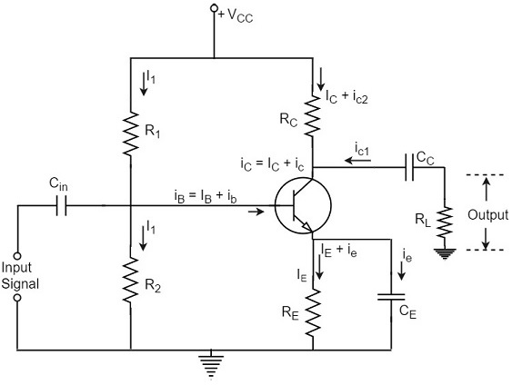
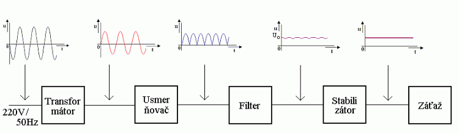
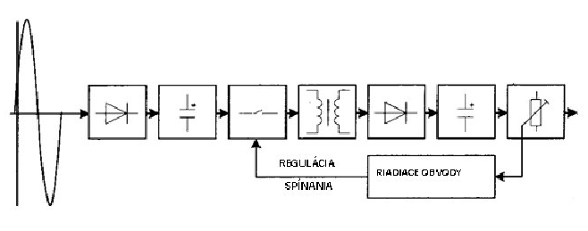
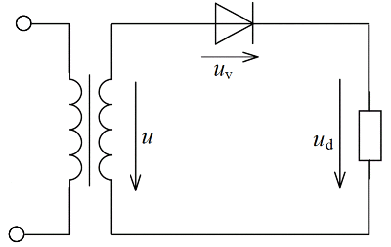
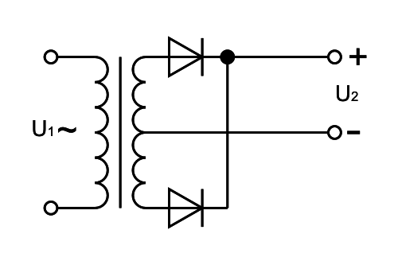
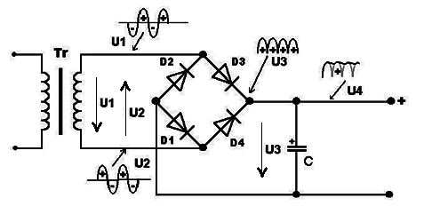
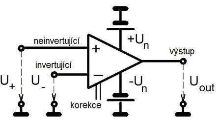
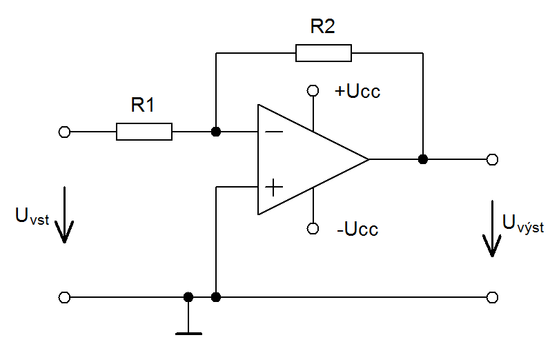
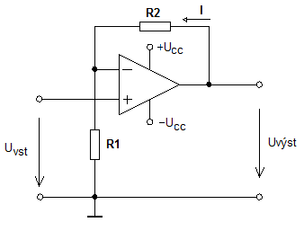

# ELE, ELK, ELM

- ### pojem elektromagnetické pole a ako vzniká
  - fyzikálne pole, ktoré zodpovedá miere pôsobenia elektrickej a magnetickej sily v priestore
  - je zložený z 2 prepojených polí, elektrického a magnetického

- ### rozdelenie elektromagnetických vĺn a ich typy šírenia
  - slúžia na prenos informácií v rádiokomunikačných zariadeniach
  - **rozdelenie ELM vĺn**: (frekvencia / vlnová dĺžka)
    - rádiové vlny 
    - mikrovlny (3-300GHz / 100-1mm)
    - infračervené vlny (10^10 - 10^14Hz / 1mm-1mikromm)
    - svetelné lúče (10^14Hz / 400-700nm)
    - UV vlny (10^14 - 10^16Hz / 400-10nm)
    - rontgenové vlny (10^16 - 10^19Hz / 10-0,1nm)
    - gama vlny (10^19 - 10^24Hz) ((10^ - 10)-(10^ - 14)m)
  - **typy šírenia**:
    - Zem - Zem (v prítomnosti zeme)
    - Zem - kozmický priestor (vo voľnom priestore)
    - kozmický priestor - kozmický priestor (vo voľnom priestore)

-  ### blokovú schému rádiového vysielača/prijímača
    - rádiový vysielač
    
    
    - rádiový prijímač
    

- ### amplitúdová, frekvenčná a fázová modulácia
  - **amplitúdová modulácia** (AM):
    - jednoduchá spojitá modulácia, pri ktorej sa mení amplitúda nosnej vlny
    - najstarší druh modulácie
    - prvé experimenty s rádiovým vysielaním
  - **frekvenčná modulácia** (FM):
    - modulácia, pri ktorej sa mení frekvencia nosnej vlny
    - amplitúda a fáza je konštaná
    - využíva sa v rozhlase v pásme VKV (Veľmi Krátkych Vĺn), zvukové kanály v analógových TV sústavách
  - **fázová modulácia** (PM):
    - modulácia, pri ktorej sa mení fáza nosnej vlny
    - amplitúda a frekvencia je konštantná
    - nie je veľmi využívaná, potrebuje zložitý demodulátor

    

- ### PCM modulácia (vzorkovanie, kvantovanie, kódovanie)
  - pulzne kódová modulácia
  - digitálna reprezentácia analógového signálu
  - **operácie**:
    - *vzorkovanie*
      - priebeh signálu sa vzorkuje určitou frekvenciou, zisťujú sa okamžité hodnoty signálu
    - *kvantovanie* 
      - okamžité hodnoty signálu sú priradené kvantovanej hodnote, kvantované hodnoty sa priraďujú podľa rozhodovacej úrovne
    - *kódovanie*
      - každej kvantovanej hodnote je priradená určitá kódová kombináca, ktorá je výsledok PCM na prenos kanálom

- ### impulzná modulácia PAM, PDM, PPM
  - **PAM** (Pulzno Amplitúdová modulácia):
    - modulácia signálu, kde sú informácie o správe zakódované v amplitúde signálových impulzov
    - podľa vzoriek z pôvodného modulačného signálu a moduluje amplitúda impulzov
    - nízka odolnosť proti šumu
  - **PDM/PWM** (Pulzno šírková modulácia):
    - podľa amplitúdy modulačné signálu sa mení šírka impulzov
  - **PPM** (Pulzno polohová modulácia)
    - podľa okamžitej hodnoty modulačného signálu sa mení poloha impulzu v čase
    

- ### elektrická schéma pre zadanú logickú funkciu
  - x

- ### základné logické členy kombinačných logických obvodov
  - negácia NOT
      | B | A 
      | - | - 
      | 0 | 1 
      | 1 | 0 
  - logický súčet OR  
      | B | A | Y 
      | - | - | -
      | 0 | 0 | 0
      | 0 | 1 | 1
      | 1 | 0 | 1
      | 1 | 1 | 1
  - logický súčin AND
      | B | A | Y
      | - | - | -
      | 0 | 0 | 0
      | 0 | 1 | 0
      | 1 | 0 | 0
      | 1 | 1 | 1
  - negovaný logický súčet NOR
      | B | A | Y
      | - | - | -
      | 0 | 0 | 1
      | 0 | 1 | 0
      | 1 | 0 | 0
      | 1 | 1 | 0
  - negovaný logický súčin NAND
      | B | A | Y
      | - | - | -
      | 0 | 0 | 1
      | 0 | 1 | 1
      | 1 | 0 | 1
      | 1 | 1 | 0
  - nezhoda X-OR
      | B | A | Y
      | - | - | -
      | 0 | 0 | 0
      | 0 | 1 | 1
      | 1 | 0 | 1
      | 1 | 1 | 0
  - zhoda X-NOR
      | B | A | Y
      | - | - | -
      | 0 | 0 | 1
      | 0 | 1 | 0
      | 1 | 0 | 0
      | 1 | 1 | 1

- ### pravdivosť niektorých výrokov boolovej algebry
  - komutatívny zákon
    - A+B = B+A ; A*B = B*A
  - asociatívny zákon
    - A*(B\*C) = (A*B)*C
  - zákon dvojitej negácie
    - !!A = A

- ### metódy UNDF a UNKF pre získanie funkcie z pravdivostnej tabuľky
  - **úplná normálna disjuktívna forma** (UNDF):
  - **úplná normálna konjuktívna forma** (UNKF):

- ### zjednodušenie získanej funkcie
  - x

- ### rozdiel medzi sekvenčným a kombinačným logickým systémom
  - **sekvenčné obvody**:
    - výstup založený na vstupoch a súčasných stavoch systému
    - majú pamäť na uchovanie stavov
    - používané na ukladanie údajov
    - väčšinou taktované
  - **kombinačné obvody**:
    - výstup založený len na súčasných vstupoch
    - nemajú pamäť na uchovanie stavov
    - používané na aritmetické a logické operácie
    - nemá hodiny, takt

- ### sekvenčné logické obvody
  - digitálny obvod, ktorého výstup je založený na vstupoch a súčasných stavoch systému
  - majú pamäť na zachovanie predchádzajúceho stavu systému
  - používané na ukladanie údajov
  - väčšinou taktované

- ### vlastnosti a použitie multiplexora a demultiplexora
  - **multiplexor MX**:
    - kombinačný obvod, ktorý má 2^n údajových vstupov a jeden výstup Y, na výstup sa penesú údaje zo vstupu, ktorý je určený adresou A,B
    - **prevod**:
      1) *prevod paralelných údajov na sériové*
        - dátový prenos je výhodnejšie realizovať v sériovom tvare, ktorý vyžaduje menej vodičov
      2) *realizácia logickej funkcie*
        - generátor logickej funkcie, ktorú nie je možné zminimalizovať
      
      
  - **demultiplexor DX**
    - obrátený multiplexor
    - kombinačný obvod, ktorý umožňuje spojenie jedného údajového vstupu Y na jeden z 2^n údajových vstupov, ktorý je určený adresou A,B,C

      

- ### kombinačný logický obvod ..., ktorý porovnáva dve vstupné jednobitové hodnoty
  - x

- ### obvody TTL a CMOS
  - logické obvody 
  - nie sú navzájom kompazibilitné
  - **TTL**
    - vyrobené s bipolárnych tranzistorov (riadené prúdom)
    - 74 xxx - komerčná (xxx - funkcia)
    - 54 xxx - MIL
    - napájanie 5V
    - vysoká prúdová spotreba (100mW/hradlo - 74xxx)
    - vysoká rýchlosť
  - **CMOS**
    - vyrobené z unipolárnych tranzistorov (riadené napätím)
    - 4 xxx
    - 74 xxx 
    - napájanie 3/18V
    - nízky prúdový odber (1nW/hradlo)
    - nízka rýchlosť
    - jednoduchá štruktúra hradla

- ### elektronické súčiastky rezistor, kondenzátor, cievka
  - **rezistor**:
    - obmedzuje prúd v obvode
    - zničíme ho vysokým prúdom
    - *v striedavom obvode*:
      - lineárny, frekvenčne závislý 
  - **kondenzátor**:
    - 2 elektródy a medzi nimi dielektrikum
    - zničíme vysokým napätím
    - schopnosť akumulovať elektrický náboj
    - používame na vyhladzovanie napätia
    - frekvenčne závislý, nelineárny
    - fázový posun -90°
  - **cievka**:
    - akumuluje energiu - margnetické pole
    - jednotka 1 L[Henry]
    - frekvenčne závislá, nelineárna
    - fázový posun 90°

- ### rezistor, trimer a potenciometer
  - **rezistor**:
    - obmedzuje prúd v obvode
    - zničíme ho vysokým prúdom
    - *v striedavom obvode*:
      - lineárny, frekvenčne závislý 
  - **trimer**:
    - rezistor s nastaviteľným odporom (väčšinou nastavenie skrutkovačom)
  - **potenciometer**:
    - rezistor s voľne nastaviteľným odporom (ladenie kanálov, zvyšovanie hlasitosti rádia, voľnou rukou)

- ### transformátor, jeho princíp a použitie
  - elektrický netočivý stroj, ktorý využíva elektromagnetickú indukciu
  - transformuje napätia - vyššie/nižšie
  - galvanicky oddeľuje obvody
  - mení impedanciu
  - konštrukcia 2 ciervky a magnetické pole

- ### dióda, tranzistor, diak, triak a tyristor
  - **dióda**
    - *usmerňovacia dióda*:
      - v pripustnom smere začne viesť (A < K) prúd až od hodnoty difúzneho napätia a vzniká na nej úbytok napätia
    - *vysoko frekvenčná dióda*:
      - použitie usmerňovacej diódy v AC obvodoch s vysokými frekvenciami prejaví nežiadúci jav, kedy sa po zmene vstupného napätia do zápornej polvlny bolasť PN prechodu nestihne dostatočne rýchlo vyprázdniť od voľných nosičov a ešte určitý čas vedie prúd aj v závernom smere
    - *schottkyho dióda*:
      - kombinácia s kovovým polovodičom 
      - vysoká rýchosť
      - nižší úbytok medzi A - K
      - nižšie napätia v závernom smere
    - *zenerová dióda*:
      - vedie prúd v závernom smere pri zenerovom napätí, nastane nedeštruktívny prieraz
  - **tranzistor**:
    - trojvývodová polovodičová súčiastka, vývody: báza, kolektor, emitor
    - základnou vlastnosťou je zosilnenie prúdu
    - *delenie*:
      - podľa technológie výroby
        - bipolárne (PNP, NPN)
        - unipolárne s kanálom typu P, N (JFET, MOSFET) - riadené napätím
      - podľa výkonu
        - nízkovýkonové, výkonové
      - podľa použitia
        - v spínacích obvodoch, v lineárnych obvodoch
      - podľa pracovnej frekvencie
        - nízko, vysokofrekvenčné
    - **diak**
      - neriadená, symetrická spínacia súčiastka, zapnutie je podmienené vonkajším napätím
      - po pripojení vonkajšieho napätia je diak v blokovacom stave, po prekročení spínacieho napätia dojde k vratnému prierazu a diak sa otvorí
    - **triak**
      - antiparalelne zapojená riadiaca súčiastka
      - dokáže viesť prúd obomi smermi 
      - pre zopnutie triaku musí byť na hlavných elektródach dostatočne vysoké napätie a na riadiacu elektródu musí byť privedenýý prúdový impulz
    - **tyristor**
      - riadená spínacia súčiastka, používa sa na reguláciu výkonu na spotrebiči
      - funguje ako ventil, prúdovým pulzom do riadiacej elektródy ho zopneme 

- ### rezistor pre zadanú schému
  - x

- ### jednotlivé druhy zosilňovačov
  - **podľa frekvencie**:
    - nízkofrekvenčný (elektroakustika)
    - vysokofrekvenčný (rádiotechnika)
    - medzifrekvenčný
  - **podľa šírky pásma**:
    - úzkopásmový
    - širokopásmový
  - **podľa druhu aktívneho prvku**:
    - elektrónkové
    - tranzistorové
    - integrované
  - **podľa použitia**:
    - zosilňovače prúdu
    - zosilňovače napätie
    - zosilňovače výkonu
  - **podľa počtu vstupov**
    - jednostupňové
    - viacstupňové

- ### princíp jednostupňového tranzistorového zosilňovača
  - pri slabom vstupnom prúde ide do bázy slabý prúd, ten ho zostilné a cez kolektor už prúdi vyšší 
  - zvýšením prúdu sa zvýši úbytok napätia na rezistore Rc, ktorý sa použije ako výstup
  

- ### vlastnosti (AU, AI, AP, ZVST, ZVÝST) tranzistora v zapojení SE, SB, SK
  - x

- ### Ohmov zákon, 1. a 2. Kirchhoffov zákon, Théveninovu a Northonovu vetu
  - **Ohmov zákon**:
    - fyzikálny zákon, ktorý definuje vzájomný vzťah medzi prúdom, napätím a odporom
    - prúd vo vodiči je priamo úmerný napätiu
    - `U = I*R`
  - **Kirchhoffove zákony**:
    - pravidlá stanovujúce princípy zachovania náboja a energie v obvode
    - *1*: súčet prúdov stupujúcich a vystupujúcich z uzla sa rovná 0, tj. aký prúd do uzla vstúpi, taký aj vystúpi
    - *2*: súčet napätí v slučke sa rovná nule
  - **Tháveninova veta**:
    - akýkoľvek lineárny obvod dokážeme nahradiť sériovým zapojením ideálneho zdroja Un a odporom, pričom napätie Un je naprázdno na svorkách pôvodného zdroja a Rn je jeho vnútorný odpor
  - **Northonová veta**:
    - sústava nelineárnych zdrojov napätia, prúdu a rezistorov s 2 svorkami je elektricky ekvivalentná k ideálnemu zdroju prúdu s paralelne zapojeným ideálnym rezistorom

- ### čo znamená efektívna, stredná, okamžitá a maximálna hodnota prúdu a napätia
  - **efektívna**: taká hodnota, ktorá vyvolá rovnaký teplotný účinok ako zodpovedajúci jednosmerný prúd/napätoe
  - **stredná**: aritmetický priemer absolútnych hodnôť napätia
  - **okamžitá**: hodnota zodpovedajúca určitému časovému okamihu
  - **maximálna**: najväčšia nameraná okamžitá hodnota

- ### funkcie prvkov R, L, C v jednosmernom a striedavom obvode
  - Rezistor, Cievka, Kondenzátor
  - **Rezistor**:
    - obmedzuje prúd v obvode
    - v jednosmernom ako delič napätia
    - v striedavom ako filter
  - **Kondenzátor**:
    - vyhladzuje napätie, ako usmerňovač
  - **Cievka**:
    - DC-DC menič, filtre pre stanovené frekvencie, oscilačné obvody

- ### pojmy elektrické napätie, prúd, výkon, odpor, vodivosť
  - **napätie**:
    - veličina, ktorá vyjadruje rozdiel elektrického potenciálu 2 bodov
    - predstavuje energiu potrebnú na premiestnenie elektrického náboja medzi 2 bodmi v elektrickom poli
    - *značka* U, *jednotka* Volt - V
  - **prúd**:
    - veličina, ktorá vyjadruje množstvo elektrického náboja, ktorý prejde vodičom za určitý čas
    - *značka* I, *jednotka* Amper - A
  - **výkon**:
    - veličina, ktorá vyjadruje vykonanú elektrickú prácu za určitý čas
    - *značka* P, *jednotka* Watt- W
  - **odpor**:
    - veličina, ktorá vyjadruje schopnosť materiálu zabraňovať prechodu elektricky nabitých častí
    - *značka* R, *jednotka* Ohm - Ω
  - **vodivosť**:
    - veličina, ktorá vyjadruje schopnosť vodiča viesť elektrický prúd (opak odporu)
    - *značka* G, *jednotka* Siemens - S

- ### postupy počítania sériovo a paralelne zapojených odporov a kondenzátorov
  - **sériové zapojenie rezistorov**:
  ```asciimath
  R_s = R_1 + R_2 + R_3 + ... + R_n
  ```
  - **paralelné zapojenie rezistorov**:
  ```asciimath
  1/R_p = 1/R_1 + 1/R_2 + 1/R_3 + ... + 1/R_n
  ```

  - **paralelné zapojenie kondenzátorov**:
  ```asciimath
  C_s = C_1 + C_2 + C_3 + ... + C_n
  ```
  - **sériové zapojenie kondenzátorov**:
  ```asciimath
  1/C_p = 1/C_1 + 1/C_2 + 1/C_3 + ... + 1/C_n
  ```

- ### hodnotu rezistora pre zadanú schému
  - x
  
- ### bloková schéma sieťového napájacieho zdroja
  

- ### klasický a spínaný napájací zdroj
  - **klasický**:
    

  - **spínaný**:
  

- ### rôzne zdroje elektrickej energie a rôzne druhy akumulátorov
  - **zdroje**:
    - **galvanické články**: (batérie):
      - zdroje napätia, chemická energia sa mení na elektrickú
    - **akumulátory**:
      - sekundárne zdroje napätia, vratné reakcie, po vybití môžeme prúdom opačného smeru nabiť
      - pri nabíjaní sa elektrická energia mení na chemickú a naopak
    - **palivové články**
      - elektrochemický zdroj DC prúdu
      - katalytické reakcie paliva a vzduchu na elektródach, ióny medzi elektródami prenáša elektrolyt
      - palivo oxiduje v elektrochemickom článku, tým sa vyrába elektrina
   - **druhy akumulátorov**:
    - Litium-Iónové - *LI-ION*
      - vysoká energie, nízke samovybíjanie
    - Nikel-Metalhydridové - *NIMH*
      - vyššie samovybíjanie
    - Litium-Polymérové - *LI-PO*
      - slabá vodivosť pri izbovej teplote 

- ### chyby a presnosť merania
  - **presnosť merania**:
    - miera správnosti a zhodnosti merania
    - miera absencie chyby v meraní
    - pre vyššiu presnosť opakujeme viac pokusov v meraniach a spriemerujeme
  - **chyby merania**:
    - *sústavné chyby*
      - nedokonalosť a nepresnosť meracích prístrojov/nepresnosť meracej metódy
    - *náhodné chyby*
      - náhodné príčiny, náhle zmeny teploty, vlhkosti
    - *omyly*
      - nepozornosť merajúcej osoby, nesprávny postup

- ### použitie analógových a číslicových meracích prístrojov
  - **analógové meracie prístroje**:
    - ukazovateľ zobrazuje nameraná hodnotu na dielikoch
    - zoberieme maximálnu hodnotu meracieho prístroja a vydelíme počtom dielokov a zistíme hodnotu 1 dielika, podľa ukazovateľ vynásobíme hodnotu počtom nameraných dielokov
  - **číslicové/digitálne meracie prístroje**:
    - digitálny ukazovateľ nameranej hodnoty
    - nastavíme maximálnu hodnotu kvôli presnosti

- ### práca s osciloskopom
  - prístroj, ktorý reaguje na priebehy napätia v obvode
  - môžeme nastaviť vertikálnu/horizontálnu polohu, presnosť (ako priblíženie na vlnu), DC/AC napätie

- ### činnosť jednocestného a dvojcestného usmerňovača
  - usmerňovač je zariadenie, ktoré sa používa na premenu striedavého prúdu na jednosmerný
  - **jednocestný usmerňovač**:
    - prepúšťa len 1 polvlnu napätia, takže má polovičňu účunnosť
    - vhodný pre zariadenia s nízkym odberom prúdu
  
  - **dvojcestný usmerňovač**:
    - používa obidne polvlny vstupného napätia
    - vhodný pre zariadenia s vyšším odberom prúdu
  

- ### mostíkové zapojenie usmerňovača
  - forma zapojenia dvojcestného usmerňovača 
  - sériové zapojenie 2 jednocestných usmerňovačov
  

- ### jednotlivé druhy stabilizátorov napätia
  - stabilizátor je elektrická súčiastka na princípe integrovaného obvodu, ktorý stabilizuje napätie/prúd pri zmenách výstupného prúdu, vstupného napätia a teploty v okolí (vonkajších javov)
  - **druhy**:
    - *lineárny parametrický stabilizátor*:
      - využíva záverný smer zenerovej diody
      - kvôli zenerovej diode potrebuje vyšší prietok prúdu, odpor znižuje jeho účinnosť
    - *lineárny spätnoväzobný stabilizátor*:
      - porovnáva referenčné a skutočné napätie pomocou tranzistora
      - miera otvorenia tranzistora je riadená prúdom, ktorý sa rovná odchýlke referenčného a požadovaného napätia
    - *spínaný spätnoväzobný stabilizátor*:
      - podobný ako lineárny spätnoväzobný, no impulz zapínania/vypínania tranzistora zodpovedá miere rozdielu referenčného a požadovaného napätia

- ### chovanie diód v zapojení ako usmerňovač a stabilizátor
  - **usmerňovač**:
    - diódy odrežú druhú polvlnu priebehu napätia
  - **stabilizátor**:
    - voltampérová charakteristika zenerovej diódy, vedie prúd až pri zenerovom napätí, stabilizuje vstupné napätie

- ### vlastnosti a parametre operačného zosilňovača
  - jednosmerný, širokopásmový, diferenciálny zosilňovač s veľkým nápäťovým zosilnením
  - má invertujúci (180° fázový posun) a neinvertujúci vstup (0° fázový posun)
  - základnou vlastnosťou je zosilňovať rozdiel napätí na jeho vstupoch a nezosilňovať, potláčať rovnaké napätia na jeho vstupoch
  - **vlastnosti**:
    - veľké napäťové zosilnenie
    - veľký vstupný odpor
    - malý výstupný odpor
    - malá teplotná závislosť
    - veľká šírka prenášaného pásma
  

- ### základné zapojenia operačného zosilňovača
  - *invertujúci zosilňovač*
  
  - *neinvertujúci zosilňovač*
  

- ### vypočítajte napätie na výstupe invertujúceho a neinvertujúceho zosilňovača
  - **invertujúci**
  ```asciimath
  U_(VYST) = - R_2/R_1 * U_(VST)
  ```
  - **neinvertujúci**
  ```asciimath
  U_(VYST) = (1 + R_2/R_1) * U_(VST)
  ```

