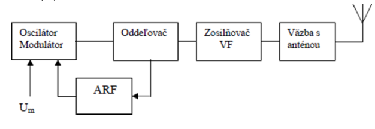
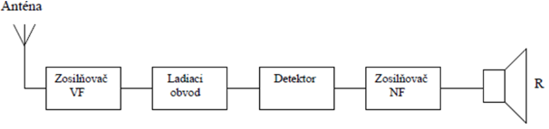
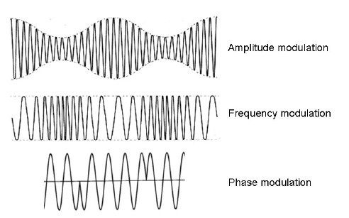
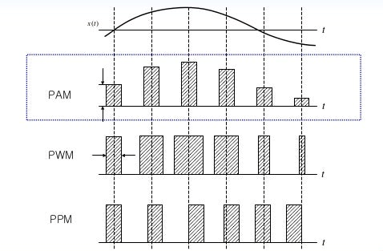
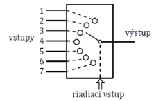
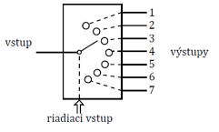

# ELE, ELK, ELM

- ### pojem elektromagnetické pole a ako vzniká
  - fyzikálne pole, ktoré zodpovedá miere pôsobenia elektrickej a magnetickej sily v priestore
  - je zložený z 2 prepojených polí, elektrického a magnetického

- ### rozdelenie elektromagnetických vĺn a ich typy šírenia
  - slúžia na prenos informácií v rádiokomunikačných zariadeniach
  - **rozdelenie ELM vĺn**: (frekvencia / vlnová dĺžka)
    - rádiové vlny 
    - mikrovlny (3-300GHz / 100-1mm)
    - infračervené vlny (10^10 - 10^14Hz / 1mm-1mikromm)
    - svetelné lúče (10^14Hz / 400-700nm)
    - UV vlny (10^14 - 10^16Hz / 400-10nm)
    - rontgenové vlny (10^16 - 10^19Hz / 10-0,1nm)
    - gama vlny (10^19 - 10^24Hz) ((10^ - 10)-(10^ - 14)m)
  - **typy šírenia**:
    - Zem - Zem (v prítomnosti zeme)
    - Zem - kozmický priestor (vo voľnom priestore)
    - kozmický priestor - kozmický priestor (vo voľnom priestore)

-  ### blokovú schému rádiového vysielača/prijímača
    - rádiový vysielač
    
    
    - rádiový prijímač
    

- ### amplitúdová, frekvenčná a fázová modulácia
  - **amplitúdová modulácia** (AM):
    - jednoduchá spojitá modulácia, pri ktorej sa mení amplitúda nosnej vlny
    - najstarší druh modulácie
    - prvé experimenty s rádiovým vysielaním
  - **frekvenčná modulácia** (FM):
    - modulácia, pri ktorej sa mení frekvencia nosnej vlny
    - amplitúda a fáza je konštaná
    - využíva sa v rozhlase v pásme VKV (Veľmi Krátkych Vĺn), zvukové kanály v analógových TV sústavách
  - **fázová modulácia** (PM):
    - modulácia, pri ktorej sa mení fáza nosnej vlny
    - amplitúda a frekvencia je konštantná
    - nie je veľmi využívaná, potrebuje zložitý demodulátor

    

- ### PCM modulácia (vzorkovanie, kvantovanie, kódovanie)
  - pulzne kódová modulácia
  - digitálna reprezentácia analógového signálu
  - **operácie**:
    - *vzorkovanie*
      - priebeh signálu sa vzorkuje určitou frekvenciou, zisťujú sa okamžité hodnoty signálu
    - *kvantovanie* 
      - okamžité hodnoty signálu sú priradené kvantovanej hodnote, kvantované hodnoty sa priraďujú podľa rozhodovacej úrovne
    - *kódovanie*
      - každej kvantovanej hodnote je priradená určitá kódová kombináca, ktorá je výsledok PCM na prenos kanálom

- ### impulzná modulácia PAM, PDM, PPM
  - **PAM** (Pulzno Amplitúdová modulácia):
    - modulácia signálu, kde sú informácie o správe zakódované v amplitúde signálových impulzov
    - podľa vzoriek z pôvodného modulačného signálu a moduluje amplitúda impulzov
    - nízka odolnosť proti šumu
  - **PDM/PWM** (Pulzno šírková modulácia):
    - podľa amplitúdy modulačné signálu sa mení šírka impulzov
  - **PPM** (Pulzno polohová modulácia)
    - podľa okamžitej hodnoty modulačného signálu sa mení poloha impulzu v čase
    

- ### elektrická schéma pre zadanú logickú funkciu
  - x

- ### základné logické členy kombinačných logických obvodov
  - negácia NOT
      | B | A 
      | - | - 
      | 0 | 1 
      | 1 | 0 
  - logický súčet OR  
      | B | A | Y 
      | - | - | -
      | 0 | 0 | 0
      | 0 | 1 | 1
      | 1 | 0 | 1
      | 1 | 1 | 1
  - logický súčin AND
      | B | A | Y
      | - | - | -
      | 0 | 0 | 0
      | 0 | 1 | 0
      | 1 | 0 | 0
      | 1 | 1 | 1
  - negovaný logický súčet NOR
      | B | A | Y
      | - | - | -
      | 0 | 0 | 1
      | 0 | 1 | 0
      | 1 | 0 | 0
      | 1 | 1 | 0
  - negovaný logický súčin NAND
      | B | A | Y
      | - | - | -
      | 0 | 0 | 1
      | 0 | 1 | 1
      | 1 | 0 | 1
      | 1 | 1 | 0
  - nezhoda X-OR
      | B | A | Y
      | - | - | -
      | 0 | 0 | 0
      | 0 | 1 | 1
      | 1 | 0 | 1
      | 1 | 1 | 0
  - zhoda X-NOR
      | B | A | Y
      | - | - | -
      | 0 | 0 | 1
      | 0 | 1 | 0
      | 1 | 0 | 0
      | 1 | 1 | 1

- ### pravdivosť niektorých výrokov boolovej algebry
  - komutatívny zákon
    - A+B = B+A ; A*B = B*A
  - asociatívny zákon
    - A*(B\*C) = (A*B)*C
  - zákon dvojitej negácie
    - !!A = A

- ### metódy UNDF a UNKF pre získanie funkcie z pravdivostnej tabuľky
  - **úplná normálna disjuktívna forma** (UNDF):
  - **úplná normálna konjuktívna forma** (UNKF):

- ### zjednodušenie získanej funkcie
  - x

- ### rozdiel medzi sekvenčným a kombinačným logickým systémom
  - **sekvenčné obvody**:
    - výstup založený na vstupoch a súčasných stavoch systému
    - majú pamäť na uchovanie stavov
    - používané na ukladanie údajov
    - väčšinou taktované
  - **kombinačné obvody**:
    - výstup založený len na súčasných vstupoch
    - nemajú pamäť na uchovanie stavov
    - používané na aritmetické a logické operácie
    - nemá hodiny, takt

- ### sekvenčné logické obvody
  - digitálny obvod, ktorého výstup je založený na vstupoch a súčasných stavoch systému
  - majú pamäť na zachovanie predchádzajúceho stavu systému
  - používané na ukladanie údajov
  - väčšinou taktované

- ### vlastnosti a použitie multiplexora a demultiplexora
  - **multiplexor MX**:
    - kombinačný obvod, ktorý má 2^n údajových vstupov a jeden výstup Y, na výstup sa penesú údaje zo vstupu, ktorý je určený adresou A,B
    - **prevod**:
      1) *prevod paralelných údajov na sériové*
        - dátový prenos je výhodnejšie realizovať v sériovom tvare, ktorý vyžaduje menej vodičov
      2) *realizácia logickej funkcie*
        - generátor logickej funkcie, ktorú nie je možné zminimalizovať
      
      
  - **demultiplexor DX**
    - obrátený multiplexor
    - kombinačný obvod, ktorý umožňuje spojenie jedného údajového vstupu Y na jeden z 2^n údajových vstupov, ktorý je určený adresou A,B,C

      

- ### kombinačný logický obvod ..., ktorý porovnáva dve vstupné jednobitové hodnoty
  - x
