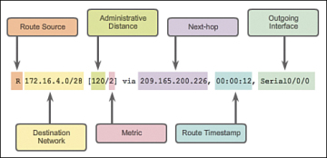
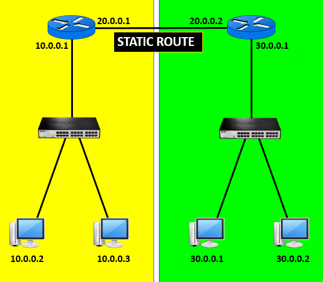

# SIE, CIT, IVI

- ### jednotlivé hrozby a útoky v počítačových sieťach
  - hacking - prienik do siete za účetlom hľadania chýb a nedostatkov v zabezpečení
  - cracking - prienik do siete za účelom škodiť
  - spoofing - vydávanie sa za overené zariadenie pod falošnou identitou
  - phishing - získavanie údajov (hesiel...) pomocou falošnej kópie webstránky/emailu
  - phreaking - prienik do telefónnej siete za účelom odposluchu alebo jej využívania
  - sociálne inžinierstvo - vydávanie sa za dôveryhodnú osobu za účelom získania údajov

- ### spôsoby zabezpečenia smerovačov a prepínačov
  - fyzicky - zamknúť do serverovne, racku na kľúč alebo čipovú kartu
  - elektronicky - nastavenie hesla pre privilegované režimy a pre SSH/Telnet porty
    - nastavenie hesla do privilégovaného módu, šifrované heslo a heslo do konzoly
    ```
    enable password
    enable secret
    line console 0
    password c1sc0
    login
    ```

- ### princíp prístupových zoznamov (ACL) v počítačových sieťach, ich použitie a delenie
  - spravuje prístup do siete, vymedzuje pravidlá
  - posielajú inštrukcie smerovačom a switchom o povolenej premávke
  - diktujú, čo môžu zariadenia a užívatelia v zariadení robiť
  - **typy ACL**:
    - *štandardný ACL*:
      - paket je blokovaný/prepustený na základe zdrojovej alebo cieľovej IP
      - označujú sa číslami 1-99
    - *rozšírený ACL*:
      - posytujú väčší rozsah kontroly: zdrojovú a cieľovú IP, protokol a port
      - označujú sa číslami 100-199

- ### jednotlivé WAN prenosové technológie
  - **tradičné**:
    - *circuit-switched* (pomocou telefonnej linky): 
      - Public Service Telephone Network (PSTN)
        - analógový prenos
      - Integrated Services Digital Network (ISDN)
        - umožňuje PSTN digitálny prenos
    - *packet-switched* (údaje premieňa na packety, ktoré prenáša cez verejnú sieť):
      - Frame Relay
        - na 2. vststve, kedysi prepájalo LANky a WANky
      - Asynchronous Transfer Mode (ATM)
        - dokáže prenášať audio, video a dáta cez verejné a súkromné siete
  - **moderné**:
      - *dedicated broadband*
        - prepojené priamo optickým vláknom
      - *packet-switched*
        - Metro Ethernet
        - MPLS (Multiprotocol Label Switching)
      - *internet-based broadband*
        - prepojenie cez internet

- ### princíp fungovania VPN (virtuálna privátna sieť), jej vlastnosti a delenie
  - zašifrovaný tunel, ktorý prepája 2 miesta na internete
  - často sa používa na vzdialený prístup k dátam
  - lacné, bezpečné, škávateľné
  - **delenie**
      1) VPN spravované podnikom
          - typy prístupových VPN
            - klientské - v prehliadači cez SSL
            - bezklientské - nainštalovaný VPN klient
          - GRE (Generic Routing Encapsulation)
            - nezabezpečené tunely
            - podporuje multicast
            - zabezpečuje sa cez IPsec
          - DMVPN (Dynamic Multiport VPN)
            - jednoduchšie vytváranie viacerých VPN (dynamické vytváranie)
            - používa mGRE (Multipoint GRE)
            - hub-and-spoke topológia
          - VTI (IPSec Virtual Tunnel Interface)
            - tunel sa pripája na virtuálne rozhranie
      2) VPN spravované poskytovateľom
          1) L2 MPLS VPN - ISP pridá MPLS hlavičku s návesťami, ktoré označuje jednotlivé tunely
          2) L3 MPLS VPN - MPLS hlavička sa pripája k ethernet rámcu, netreba smerovanie

- ### protokoly na správu siete (CDP, LLDP, NTP, SNMP, Syslog)
  - **CDP** (Cisco Discovery Protocol):
    - Cisco proprietárny
    - L2 protokol, ktorý zbiera údaje o CISCO zariadeniach na 1 link
    - odosiela CDP inzeráty k pripojeným zariadeniam, ktoré nesú údaje
  - **LLDP** (Link Layer Discovery Protocol):
    - protokol, ktorý zbiera údaje o pripojených zariadeniach
    - komunikuje so zariadeniami a získava od nich údaje... (identitu, susedov)
  - **NTP** (Network Time Protocol):
    - protokol na synchronizáciu času na smerovačoch pomocou NTP servera
    - používa hierarchické zdroje času, každá úroveň sa nazýva stratum (max 16)
      - 0 - najpresnejšie
      - 16 - desynchronizovaný čas
  - **SNMP**:
    - protokol, ktorý poskytuje formát správ a komunikáciu medzi správcami a zástupcami na správu uzlov (nodes)
      - SNMP manager (1) - get/set správy
      - SNMP agent (spravované uzly) - trap (eventy, keď sa niečo stane)
      - Management information base (MIB) 
  - **Syslog**:
    - logovacia služba na monitorovanie, zoskupinie a zisťovanie akcií na zariadení
    - má úrovne dôležitosti (0-7):
      0 - emergency
      1 - alert
      2 - critical
      3 - error
      4 - warning
      5 - notification
      6 - informational
      7 - debug

- ### optické spektrum, optické siete a optické spoje
  - **optické spektrum**:
    - skladá sa častí:
      - infračevej
      - viditeľnej
      - ultrafialovej 
    - na prenos optického signálu sa používa infračervená časť, ktorá má vo vlákne nízky relatívny útlm (0,3dB/km)
  - **optické siete**:
    - skladá sa z jednotlivých optických spojov, obsahuje aj geografické územie
      - transportná časť
      - prístupová časť
    - celý návrch siete je hierarchický a modulárny, uzly sa prepájajú horizontálne (na rovnakej úrovni) a vertikálne (medzi úrovňami)
    - *vývojový trend*:
      - transportná časť je už dobudovaná
      - prístupová časť sa buduje
    - *dokumentácia siete*:
      - majetková správa
      - územný rozsah
      - aktuálny technický stav
      - aktuálny stav zaťaženia
  - **optické spoje**:
    - prenosový systém, ktorý prepája 2 miesta v sieti, skladá sa z rôznych komponentov
    - *delenie komponentov*:
      1) vnútorné, vonkajšie
      2) aktívne, pasívne

- ### komponenty optických sietí a typy optických vlákien
  - *komponenty*:
    - optické káble
    - optické spojky
    - optické konektory 
    - prepájacie moduly (pigtail, patchcord)
    - mechanické spojky
    - zvary/pevné spoje
  - *typy optických vlákien*:
    - viacvidové 
      - na kratšie vzdialenosti (vrámci budov)
      - lacnejšie ako jednovidové
    - jednovidové
      - na dlhé vzdialenosti 

- ### odhad útlmu a prevádzkové meranie optických trás 
  - **odhad útlmu**:
    - odhadujeme, aby sme vedeli akú reálnu hodnotu môžeme namerať
    - nameraná hodnota nesmie byť väčšia ako odhad
    - odhad každej trasy robíme pre 2 vlnové dĺžky
    - *zložky*:
      - vložený útlm optického vlákna v trase
        - merný útlm [dB/km] * dĺžka trasy [km] = [db]
      - vložený útlm konektorových spojení na trase
        - limit útlmu na konektorové spojenie [dB] * počet spojení [dB]
      - vložený útlm zvaru na trase
        - limit útlmu [dB] * počet zvarov 
    - odhadovaný útlm je súčet všetkých 3
  - **meranie optických trás**:
    - meria sa 2 metódami
      - útlm priamou metódou
        - zdroj optického signálu a merač úrovne optického signálu
        - zariadenie pripojíme na priamo 1-3 patchocordami, zistíme tým pridaný útlm mimo meracej trasy
        - meriame pomocou preddefinovanej tabuľky
      - námer reflektometrom (OTDR - Optical Time Domain Reflectometer)
        - do vlákna vyšleme optický impulz, a na tej istej strane vlákna snímame časovú závislosť spätného rozptylu a odrazu
        - dĺžka impulzu od 1 mikrosekundy pri trase 10tok km
        - výsledkom je námerová krivka
    - meria sa každé vlákno zvlášť
    - meria sa pomocou 2 vlnových dĺžok
    - meria sa v prevádzke (3. fáze životnosti kábla)

- ### princíp činnosti DNS a hierarchickú štruktúru DNS
  - (Domain Name System) - menný systém na internete
  - prekladá mená na IP adresy
  - menný server spracováva informácie, ktoré sa pôvodne nachádzali na jednotlivých hostiteľoch
  - **DNS hierarchia**:
    1) root level (menný server)
    2) top level domény (com, eu, sk, cz, net, org)
    3) second level domény (názov domény... __spsknm__.sk)
    4) sub doména (**spsknm**.edupage.org)
    5) hostiteľ
  
- ### princíp činnosti protokol prekladu adries NAT
  - Network Address Translation
  - umožňuje pripojenie viacerých zariadení na internet pod 1 verejnou IP adresou
  - pri vstupe na internet sa lokálna IP adresa preloží na globálnu (verejnú) IP adresu, pri vrátení packetu sa verejná IP premení na lokálnu

- ### princíp činnosti protokolu DHCP
  - Dynamic Host Configuration Protocol
  - protokol na dynamické prideľovanie IP adries v sieti, zariadenie si vyžiada IP adresu a DHCP server mu pridelí dostupnú adresu
  - dostupné adresy uchováva v databáze/tabuľke

- ### prenosová technológia Ethernet
  - súbor technológií na pripojenie do počítačových sietí
  - používajú sa káble:
    - krútený pár (pomalšie)
    - optické vlákna (rýchle)
  - realizuje sa fyzickou a linkovou vrstvou OSI modelu 

- ### ethernetový prepínač, jeho časti, funkcie a vlastnosti, faktory výberu ethernetového prepínača
  - sieťové hardvérové zariadenie, ktoré prepája zariadenie pripojené káblom (PC, Wi-Fi access pointy, PoE svietenie, servery) aby mohli spolu komunikovať
  - oproti hubu, ktorý je na fyzickej vrstve, ethernetový prepínač spravuje tok dát, smeruje ho medzi portami podľa hlavičky packetu a MAC adresy
    - dokáže limitovať prenos alebo priradiť viac prenosovej rýchlosti na určitý port bez degradácie výknu
    - pri viacerých aktívnych zariadeniach je ethernetové prepínanie efektívnejšie
    - znižuje výpadky
  - **faktory výberu**:
    - počet portov
    - očakávaný bandwidth
    - efektívnosť napájania
    - veľkosť
    - frekvencia aktualizácií
    - cena
    - PoE
    - spoľahlivosť
    - fixné/modulárne

- ### proces prepínania rámcov v ethernetovom prepínači
  - prepínač v pamäti vytvorí tabuľku MAC adries všetkých zariadení na portoch
  - po zapnutí je MAC tabuľka prázdna, prepínaš rozpošle dátové rámce všetkým zariadeniam, no príjme ho len zariadenie pre ktoré je rámec určený
  - odpoveďou na rámec sa zariadenie zapíše do MAC tabuľky
  - podľa mac tabuľky porovnáva zariadenia na portoch, podľa toho vie kam preposlať dáta

- ### konfiguračné príkazy ethernetového prepínača
  ```
  show version
  show running-config
  show interfaces

  enable secret cisc0
  line console 0
  password cisc0
  login
  hostname MENO_PREPINACA

  interface fa0/1
  ip address 192.168.1.2 255.255.255.0
  exit
  ip default-gateway 192.168.1.1
  ```

- ### princíp činnosti protokolov pre agregáciu liniek v prepínaných ethernetových sieťach
  - agregácia portov, ktorá zoskupí viac pripojených zariadení a môžu vystupovať cez 1 IP adresu ako 1 zariadenie

- ### dôvody používania redundancie v prepínaných ethernetových sieťach a problémy, ktoré to spôsobuje
  - v prípade výpadku sa použije iná, redundantná linka, tým sa zamedzí úplnému výpadku
  - redudancia môže vytvárať fyzické slučky v topológii siete, packety sa odrážajú späť k prepínaču, ktorý ich poslal
  - na prevenciu slučiek sa používa Spanning Tree Protocol (STP)

- ### princíp činnosti protokolu STP v ethernetových prepínačoch a jednotlivé verzie STP
  - v prípade redundancie liniek v prepínanych sieťach 2 alebo viacerými prepínačmi sa môžu tvoriť fyzické slučky
  - STP zabraňuje tvorbe slučiek pomocou Spanning Tree Algoritmu
  - prepínače si vymieňajú BDPU rámce s cenami trás a prioritami, podľa týchto informácií STP zablokuje redundantné linky, ktoré by spôsobili slučku
  - **verzie**:
    - *Spanning Tree Protocol (STP)*
    - *Per-VLAN Spanning Tree (PVST+)* - STP pre každú VLAN
    - *Rapid Spanning Tree Protocol (RSTP)* - STP s rýchlejšou konvergenciou
    - *Rapid Per-VLAN Spanning Tree (Rapid PVST+)* - STP pre každú VLAN s rýchlejšou konvergenciou
    - *Multiple Spanning Tree Protocol (MSTP)* - viac VLAN do jedného STP
   
- ### princíp činnosti protokolov FHRP v ethernetových prepínačoch
  - First Hop Redundancy Protocol
  - protokol na ochranu default gateway
  - umožňuje 2 alebo viacerým smerovačom zastúpiť smerovač, ktorý vypadne
  - zástupný smerovač nahradí vypadnutý smerovač do pár sekúnd 

- ### počítačové siete podľa rôznych kritérií
  - **podľa veľkosti**:
    - *PAN* - Personal Area Network; malá osobná sieť (notebook + mobil)
    - *LAN* - Local Area Network; prepojenie zariadení v rámci 1 budovy (PC + PC + mobil)
    - *MAN* - Metropolitan Area Network; metropolitná sieť, prepája lokálne siete (v meste)
    - *WAN* - Wide Area Network; spája LAN a MAN v rámci krajín/kontinentu (firemné pobočky)
  - **podľa funkčného stavu**:
    - *Klient - Server* - server poskytuje rôzne služby klientom
    - *Peer-To-Peer* - rovnocenné prepojenie zariadení bez správcu
  - **podľa topológie**:
    - *zbernicová* - zariadenia pozdĺžne spojené
    - *hviezdicová* - zariadenia pripojenie k jednému centrálnemu bodu
    - *mrežová* - zariadenia prepojené medzi sebou

- ### princípy činnosti sieťových zariadení
  - *repeater* (opakovač) - obnovuje signál, ktorý po dlhšom úseku degraduje, stráca ale pôvodné charakteristiky (silu a tvar)
  - *hub* (rozbočovač) - spája niekoľko častí siete do jedného segmentu
  - *bridge* (most) - spája 2 časti siete
  - *switch* (prepínač) - spája 2 alebo viac zariadení vrámci 1 alebo viacerých segmentov (logicky aj fyzicky)
  - *router* (smerovač) - smeruje premávku do iného segmentu siete rovnakého typu
  - *gateway* (brána) - sprostredkuje komunikáciu rôznych typov siete

- ### jednotlivé druhy sieťových médií a ich vlastnosti
  - **krútený pár**
    - používané v telekomunikáciach a môžu spájať ethernetové siete
    - pár káblov, ktoré prenášajú dáta
    - káble majú v okolí malé magnetické pole
    - prenosová diaľka do 300m
    - rýchlosť do 1gbps
    - druhy:
      - *UTP* - netienený
      - *STP* - tienený
  - **koaxiálny kábel**:
    - dutý vodič s vnútornými káblami z 2 vodivých materiálov
    - má 2 vrstvy izolácie - gumená izolácia a metalická fólia (ochrana pred vonkajšími signálmi)
    - lacnejší ako UTP, väčšia prenosová diaľka (500m) a nižšia rýchlosť (10 - 100mbps)
  - **optické vlákno**:
    - vlákna, ktoré prenášajú signál svetlom
    - odolné proti vonkajším signálom
    - prenosová diaľka až do 100km
    - drahé

- ### možnosti prístupu k LAN prepínaču
  - ssh, telnet (pre vzdialené pripojenie musíme mať IP, teda SVI), konzolový port

- ### virtuálne LAN siete (VLAN), ich princíp, výhody, módy portov access a trunk
  - logické podsiete, ktoré sú spojené medzi rôznymi fyzickými LAN sieťami a tvoria jednu skupinu
  - **access mode**:
    - používa sa pri 1 VLAN
    - väčšinou prístup PC a koncového zariadenia (tlačiarne) cez prepínač
    - nižší bandwidth
  - **trunk mode**:
    - prenáša údaje pri 1 alebo viacerých VLAN na rovnakej fyzickej linke
    - switch-switch; switch-router; switch-server 
    - vyšší bandwidth

- ### rôzne typy smerovania medzi VLAN sieťami
  - **legacy routing**:
    - prepojenie VLAN switchu a smerovača toľkými káblami, koľko máme VLAN
  - **router on a stick**:
    - na rozhraní vytvoríme podrozhrania, pre každú VLAN vytvoríme SVI
  - **multilayer switch**:
    - prepínanie na 3. vrstve
    - podporuje SVI
    - pokiaľ switch dostane L2 packet, switch ho presmeruje

- ### smerovací protokol EIGRP, vlastnosti, metrika, algoritmus DUAL, možnosti konfigurácie
  - pokročilý, Cisco proprietárny protokol smerového vektora
  - **algoritmus DUAL** (bezslučkový)
    - Diffusing Update Alrogithm
    - vyberá najlepšiu trasu medzi sieťami
  - **metrika** 
    - bandwidth, delay, reliability, load
  - používa RTP - spoľahlivý transportný protokol, ktorý potvrdzuje niektoré typy packetov
  - obmedzuje zbytočné posielanie aktualizácií
  - rozkladanie záťaže
  - autentifikácia EQUAL
  - packety: hello, ACK, update, query, reply
  
- ### smerovací protokol OSPF, vlastnosti, metrika, možnosti konfigurácie
  - smerovací protokol stavu linky
  - používa SPF algoritmus 
  - autentifikácia IPsec
  - **metrika**:
    - 10^8/interface bandwidth
  - router ID je 32 bitové číslo (1.1.1.1)
  - *vlastnosti*:
    - beztriedy
    - efektívny
    - škálovateľný
    - bezpečný (šifruje)
  - **OSPFv2**
    - IPv4 adresy
  - **OSPFv3**
    - IPv6 adresy

- ### single-area a multi-area smerovanie pomocou OSPF, typy OSPF smerovačov
  - **single-area**:
    - všetky smerovače v 1 (backbone) oblasti
    - vhodné pre menšie siete
  - **multi-area**:
    - 2 úrovňová hierarchia, ktorá má viac oblastí pripojených k oblasti 0 (backbone)
    - vhodné pre väčšie siete
    - oblasti nie sú na sebe závislé 
  - **typy OSPF smerovačov**:
    - interné smerovače 
      - v rovnakej oblasti
    - area border
      - medzi OSPF a non-OSPF sieťami
    - autonomous systems boundary
    - backbone
      - v oblasti 0 (backbone)

- ### sieťové vrstvové modely TCP/IP a OSI
  - **OSI model**:
    - referenčný model, ktorý sa používa na návrhy sietí
    - nedefinuje žiadne protokoly, ale je podkladom pre komunikáciu
    - *7 vrstiev*:
      1) aplikačná - užívateľké rozhrania, dáta
      2) prezentačná - prezentácia dát zo služieb aplikačnej vrstvy
      3) relačná - spojenie medzi aplikáciami, zabezpečenie, prihlásenie
      4) transportná - príprava dát na prenos, tvorba menších balíkov na prenos
      5) sieťová - pracuje s IP adresami, vyhľadávanie najlepšej trasy
      6) linková - riadi prístup jednotlivých staníc k zdieľanému médiu, vymieňa dáta medzi susednými zariadeniami
      7) fyzická - popisuje elektrické a optické signály, komunikácia, kabeláž
    - pri odosielaní sa dáta posielajú po vrstvách zhora nadol
    - pri prijímaní sa dáta posielajú po vrstvách zdola nahor

  - **TCP/IP model**:
    - skupina protokolov, ktoré sa používajú pri komunikácii
    - *4 vrstvy*:
      1) aplikačná - rovnako ako OSI model + prezentačná a relačná
      2) transportná - rovnako ako OSI model
      3) internetová - rovnako ako sieťová vrstva OSI modelu
      4) priamy prístup k médiu - rovnako ako fyzická a linková vrstva OSI modelu

- ### aplikačné protokoly: HTTP, HTTPS, protokoly pre e-mail, DNS, DHCP, TELNET, SSH
  - **HTTP** (Hyper Text Transfer Protocol) /port 80/: 
    - protokol na prenos hypertextových dokumentov (HTML) medzi serverom a klientom
  - **HTTPS** (Hyper Text Transfer Protocol Secure) /443/:
    - HTTP protokol, ktorý navyše šifruje prenos dát
  - *protokoly pre e-mail*:
    - **SMTP** (Simple Mail Transfer Protocol) /465/:
      - prenos emailov z lokálneho klienta na adresu príjemcu 
    - **POP3** (Port Office Protocol version 3) /995/:
      - jednosmerný protokol na prijímanie emailov
      - stiahne kópie emalov zo servera na lokálne zariadenie
    - **IMAP** (Internet MEssage Access Protocol) /993/:
      - dvojsmerný protokol na prijímanie emailov
      - oproti POP3 stiahne len hlavičku mailu, obsah e-mailu číta zo servera
  - **DNS** (Domain Name System):
    - menný systém na internete, menný server prekladá domény na IP adresy 
    - najznámejší od Google 8.8.4.4 a 8.8.8.8, Cloudflare 1.1.1.1
  - **DHCP** (Dynamic Host Configuration Protocol):
    - protokol na dynamické priraďovanie IP adries zariadeniam, ktoré si ju vyžiadajú
    - do tabuľky si ukladá zabraté IP adresy
  - **TELNET** /23/: 
    - aplikačný protokol používaný na prenos interaktívnej textovej komunikácie cez virtuálny terminál
    - nešifrovaná komunikácia
  - **SSH** (Secure Shell) /22/:
    - protokol na vzdialenú administráciu serverov cez internet
    - náhrada Telnetu, SSH je šifrovaný

- ### transportné protokoly TCP a UDP, ich vlastnosti, použitie, porty
  - **TCP** (Transmission Control Protocol):
    - vytvorí pripojenie medzi 2 zariadeniami a potom začne prenos
    - pomalší, ale spoľahlivý prenos
    - použitie: FTP, prehliadanie webu, e-maily
    - unicast
  - **UDP** (User Datagram Protocol)
    - pošle údaje zariadeniu, ktoré ich prijíma, ak sa však po ceste stratia a nedostane ich, nerieši, nevytvára pripojenie
    - rýchlejší, ale negarantuje nám spoľahlivý prenos (best effort)
    - použitie: Priame video prenosy, Online hry, VoIP telekomunikácia
    - unicast, multicast, broadcast

- ### sieťové protokoly IPv4 a IPv6, ich vlastnosti
  - **IPv4**:
    - 32-bit IP adresy
    - 4,3 miliárd IP adries
    - oddelené desatinnou bodkou (192.168.0.1)
    - rozdelené na 4 oktety: 1.2.3.4
    - DHCP/statické priradenie
  - **IPv6**:
    - 128-bit IP adresy
    - 7,9*10^28 IP adries
    - oddelené hexadecimálne
    - auto konfigurácia
    - end-to-end šifrovanie

- ### pojmy MAC adresa, IP adresa, sieťová adresa, broadcastová (všeobecná) adresa, maska podsiete, prefix siete
  - **MAC adresa** (Media Access Control):
    - naviazaná k fyzickému NIC rozhraniu zariadenia
    - fyzická adresa zariadenia
    - 48-bit číslo
    - 12 miestne hex
  - **IP adresa**
    - logický číselný identifikátor uzla v sieti, ktorý komunikuje s ostatnými pomocou IP protokolu
  - **Sieťová adresa**:
    - verejná IP adresa uzla v sieti
  - **Broadcastová (všeobecná) adresa**:
    - adresa, ktorá sa prenáša všetkým zariadeniam pripojeným do siete
  - **maska podsiete**
    - 32 bitové číslo, ktoré hovorí ako je rozdelená IPv4 adresa na časť siete a hostiteľa
    - delí sieť do podsietí
  - **prefix siete**
    - agregácia IP adresy (max 32)
    - 192.63.120.1/**17** - prvých 17 bitov adresy je agregovaných, zostávajúcich 15 bitov do 32 môže byť rozdelených do podsietí alebo pridelených zariadeniam 

- ### pojmy privátny adresný priestor, unicast, multicat, broadcast
  - **privátny adresný priestor**
    - adresy, ktoré sú pridelené v rámci lokánej siete a nesmerujú do internetu
    - 192.168.0.0/24
  - **unicast**
    - odosielanie packetov 1 cieľu
  - **multicast**
    - odosielanie packetov viacerým cieľom súčasne
  - **broadcast**
    - odosielanie packetov všetkým klientom/cieľom súčasne

- ### výpočty s IPv4 adresami – výpočet sieťovej adresy z hostiteľskej, výpočet hostiteľov v sieti,
prevod medzi maskou siete a prefixom
  ```c
  17.170.0.0/16 

  0001 0001 . 1010 1010 . 0000 0000 . 0000 0000 // 17.170.0.0 v binárnej
  1111 1111 . 1111 1111 . 0000 0000 . 0000 0000 // prefix 16, takže 16x1 za sebou, ostatné 0 do konca adresy
  
  0001 0001 . 1010 1010 . 0000 0000 . 0000 0000 // logický súčin 17.170.0.0 a prefixu 16

  17.170.0.0 // adresa siete -> prepočítaný logický súčin do decimálnej
  17.170.0.1 // 1. hostiteľ, 1. použiteľná adresa, vždy +1 bit
  ```

- ### mechanizmus agregácie (spájania) sietí
  - niekoľko užívateľov ISP v danom okamiho zdieľa vyhradenú prenosovú rýchlosť
  - vyjadruje sa ako pomer, minimálny podiel rýchlosti a maximálny podiel rýchlosti
    - agregácia 1:10 pri pripojení 100mbps je teda minimálne 10mbps až 100mbps

- ### mechanizmus vytvárania podsietí
  - podsiete vytváramé pre maximálne využitie adresného rozsahu a použitie viacerých sieťovych másk
  - zabraňujeme plýtvaniu adresami
  - napr. rozdelenie siete podľa triedy X s 32 užívateľmi

- ### smerovač, jeho časti, funkcie a vlastnosti
  - sieťové zariadenie, ktoré smeruje premávku medzi sieťami
  - pracuje na 3. vrstve 
  - používa sa v LAN a WAN sieťach
  - **časti**:
    - CPU
    - RAM - obsahuje bežiacu konfiguráciu (running-config)
    - ROM - OS 
    - NVRAM - štartovacia konfigurácia (startup-config)
    - Porty
      - Ethernet
      - Serial
      - DSL
      - DC napájanie 

- ### operačný systém IOS smerovača a jeho operačné módy
  - OS používaný na Cisco zariadeniach (smerovače, prepínače)
  - obsahuje GUI a CLI
  - **operačné módy**:
    - užívateľský
    - privilegovaný mód
    - konfiguračný mód
      - konfigurácia rozhrania
      - konfigurácia zariadenia

- ### základná konfigurácia smerovača
  ```js
   conf t
   hostname MENO
   banner motd # LEN PRE VYVOLENYCH
   
   //zabezpečenie smerovača 
   enable password
   enable secret
   line console 0
   password c1sc0
   login

   //konfigurácia ethernetu
   interface fa0/1
   description LAN1
   ip address 172.16.255.1 255.255.255.128
   no shutdown
   exit
  ```

- ### pojmy smerovanie, statické smerovanie, dynamické smerovanie, smerovacia tabuľka, metrika 
  - **smerovanie**:
    - výber správnej cesty packetu cez 1 alebo viac sietí
  - **statické smerovanie**:
    - manuálne nakonfigurované cesty smerovania packetov zariadení
    - nízka náročnosť na smerovač
    - úplná kontrola nad smerovaním
    - vhodné pre malé siete
  - **dynamické smerovanie**:
    - cesty smerovania vyberá router podľa smerovacieho algoritmu v reálnom čase
    - protokoly OSPF, RIP, EIGRP
    - vyššia náročnosť na smerovač
    - menšia kontrola nad smerovaním
    - vhodné pre väčšie siete
  - **smerovacia tabuľka**:
    - tabuľka, ktorá uchováva ciele v sieti a ich metriky
    - obsahuje informácie o topológii
  - **metrika**
    - výpočet hodnotu úkonu na zariadení
    - hodnota cesty medzi smerovačom a cieľovou sieťou
    - packet sa posiela vždy najlacnejšou cestou (najmenšou metrikou)

- ### trasy, administratívna vzdialenosť
  - dôveryhodnosť zdroja smerovania, protokolu

- ### predložený výpis smerovacej tabuľky - opis
  - zoznam v podobe tabuľky, kde máme zobrazené zdroje, cieľové IP adresy a ich rozhrania
  - `show ip route`
  

- ### konfigurácia statického smerovania
  
  ```js
  //R1
  enable
  conf t

  int s/0/0
  ip address 20.0.0.1 255.0.0.0
  no shutdown

  int fa0/0
  ip address 10.0.0.1 255.0.0.0
  no shutdown

  //R2
  enable
  conf t

  int s/0/0
  ip address 20.0.0.2 255.0.0.0
  no shutdown

  int fa0/0
  ip address 30.0.0.1 255.0.0.0
  no shutdown
  ```

- ### statické a dynamické smerovanie - porovnanie
  - **statické smerovanie**
    - nastavujeme manuálne pridávaním ip adries "na tvrdo"
    - rýchle, bezpečnejšie, vhodné pre menšie siete, predvídavé
  - **dynamické smerovanie**
    - automatické smerovanie pomocou smerovacieho protokolu 
    - pomalšie, menej bezpečné, efektívne pre väčšie siete

- ### dynamické smerovacie protokoly podľa rôznych hľadísk
  - **vnútorné** (vo vnútri autonómneho systému):
    - *distance vector protocol* (RIP, EIGRP):
      - vymieňajú si smerovacie aktualizácie
    - *link-state protocol* (OSPF):
      - pozná stav každej linky
  - **vonkajšie** (medzi autonómnymi systémami):
    - path-vector protocol (BGP)
  - **classful**:
    - neposielajú susedovi masku podsiete
  - **classless**:
    - posielajú susedovi aj masku podsiete
    - RIPv2, EIGRP, OSPF

- ### dynamický smerovací protokol RIP
  - Routing Information Protocol
  - dynamický smerovací protokol, ktorý používa počet hops ako metriku na získanie najlepšej trasy medzi cieľami v sieti
  - protokol distance-vector
  - **hops**: počet smerovačov cez ktoré prejde packet pred dosiahnutím cieľa
  - **verzie**:
    - *RIPv1*: 
      - posiela aktualizácie smerovaní ako broadcast (všetkým)
      - classful
      - nepodporuje autentifikáciu
    - *RIPv2*:
      - posiela aktualizácie smerovaní ako multicast (len vybraným zariadeniam)
      - classless
      - podporuje autentifikáciu
    - *RIPng*:
      - posiela aktualizácie smerovaní ako multicast 
      - classless
      - podpora IPv6

- ### architektúra Internetu vecí a pojem IoT obecne
  - **architektúra**:
    - *Data management layer*
      - zbieranie údajov od používateľov IoT
    - *Application layer*
      - distribúcia prostriedkov medzi používateľov IoT
    - *Network layer*
      - siete na prenos prostriedkov IoT
    - *Perception layer*
      - zobrazenie prostriedkov IoT

- ### komponenty Internetu vecí
  - **senzory a koncové zariadenia**
    - snímanie poznatkov
  - **sieť**
    - prenos poznatkov
  - **zabezpečenie**
    - zabezpečenie prenosu poznatkov
  - **výpočtový systém**
    - spracovanie poznatkov
  - **technologické štandardy**
    - Wi-Fi, HTTP, Bluetooth
  - **inteligentné poznatky a akcie**
    - umelá inteligencia, výber akcií na základe získaných poznatkov
    
      
